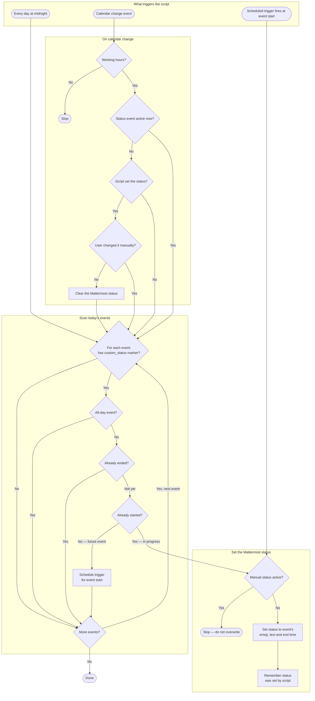

# MatterStatus

Automatically sync your Mattermost custom status with your Google Calendar. MatterStatus watches your calendar and updates your status in real-time based on events.

## Getting Started

### Installation

1. Clone this repository:

   ```bash
   git clone https://github.com/f-atwi/matter-status.git
   cd matter-status
   ```

2. Install npm if you haven't already.

    ```bash
    # For Debian/Ubuntu
    sudo apt update
    sudo apt install npm
    ```

3. Install clasp (Google Apps Script CLI):

   ```bash
   sudo npm install -g @google/clasp
   ```

4. Authenticate with Google:

   ```bash
   clasp login
   ```

    Follow the prompts to authorize clasp with your Google account.

5. Link to your Google Apps Script project:

   **First time:** create a new Apps Script project:

   ```bash
   clasp create --type webapp
   ```

   **Re-cloning** (you already have an Apps Script project): find your script ID with `clasp list`, then clone it:

   ```bash
   clasp clone <scriptId>
   ```

### Configuration

1. Copy the sample config:

   ```bash
   cp config.js.sample config.js
   ```

2. Edit `config.js` with your settings:

   ```javascript
   const USER_CONFIG = {
     WORK_START_HOUR: 8,           // Ignore events before this hour
     WORK_END_HOUR: 18,            // Ignore events after this hour
     MATTERMOST_URL: "https://your-instance.com",
     MATTERMOST_TOKEN: "your-token-here",
   };
   ```

   Need your Mattermost token? See [Find Your Mattermost Token](#find-your-mattermost-token).

3. Push to Google Apps Script:

   ```bash
   clasp push
   ```

### Initial Setup

Set up automatic triggers (run once):

1. Open the script in your browser:

   ```bash
   clasp open
   ```

2. Select `setupRecurringTriggers` from the function dropdown and click **Run**

3. Authorize the script when prompted

Done! The script will now run automatically.

**Next step:** Create your first status event. See [Create a Status Event](#create-a-status-event).

## How-to Guides

### Create a Status Event

Add a calendar event with a custom status:

1. Create a new event in Google Calendar
2. In the description, add:

   ```json
   custom_status
   {
     "emoji": "laptop",
     "text": "In a meeting"
   }
   ```

    !! Note: The `custom_status` marker is required.
    Events without it will be ignored.
3. Save the event

The status will update automatically when the event starts and clear when it ends.

See [Event Description Format](#event-description-format) for the exact format and available emoji options in [Available Emojis](#available-emojis).

### Find Your Mattermost Token

1. Go to Mattermost
2. Click your profile → Account Settings
3. Select "Personal Access Tokens"
4. Click "Create New Token"
5. Copy the token and paste it in `config.js`

### Change Working Hours

Edit `config.js` to adjust when status updates are active:

```javascript
WORK_START_HOUR: 9,    // Status updates start at 9 AM
WORK_END_HOUR: 17,     // Status updates stop at 5 PM
```

Status updates outside these hours are ignored. See [Configuration Reference](#configuration-reference) for details.

## Reference

### Available Emojis

[Emoji names can be found here](https://www.webfx.com/tools/emoji-cheat-sheet/).

Custom mattermost emojis can also be used.

### Event Description Format

```json
custom_status
{
  "emoji": "emoji_name",
  "text": "Your status text"
}
```

- `custom_status` marker is required (case-insensitive)
- Both `emoji` and `text` fields are required
- Events without this marker are ignored

### How It Works



1. **Morning trigger** (daily at 00:00): Scans today's events for status markers
2. **Calendar trigger** (on event updates): Immediately checks for status changes
3. **Status update**: When an event starts, your Mattermost status is updated
4. **Status clear**: The duration of the status is set to the event end time. When the event ends, the status is cleared.

### Configuration Reference

| Setting | Type | Description |
| ------- | ---- | ----------- |
| `WORK_START_HOUR` | number | Hour (0-23) when status updates begin |
| `WORK_END_HOUR` | number | Hour (0-23) when status updates stop |
| `MATTERMOST_URL` | string | Your Mattermost instance URL |
| `MATTERMOST_TOKEN` | string | Personal access token (keep secret!) |

Working hours are only used for reducing the number of API calls outside business hours.
Any calendar events outside these hours are ignored.
Though we cannot have a conditional trigger based on time,
the handler function returns early if the current time is outside working hours.

## Troubleshooting

**Status not updating?**

- Check that `custom_status` is in the event description
- Verify working hours include the event time
- Open `clasp open` and check the logs

## Known Limitations

- **Single calendar**: Only the user's primary calendar is monitored. Multiple calendars are not supported.
- **No overlapping events**: The script assumes no overlapping events with status markers. Overlaps may lead to unexpected behavior.
- **Status clearing behavior**: When calendar events are updated or deleted, the script clears any active status if no event is currently active and the status was set by this script. Custom statuses set outside of this script are preserved.
- **Manual status takes priority**: If you set a custom status manually (e.g. an out-of-office status), the script will not overwrite or clear it. Calendar-based updates resume only once the manual status expires or is removed.
